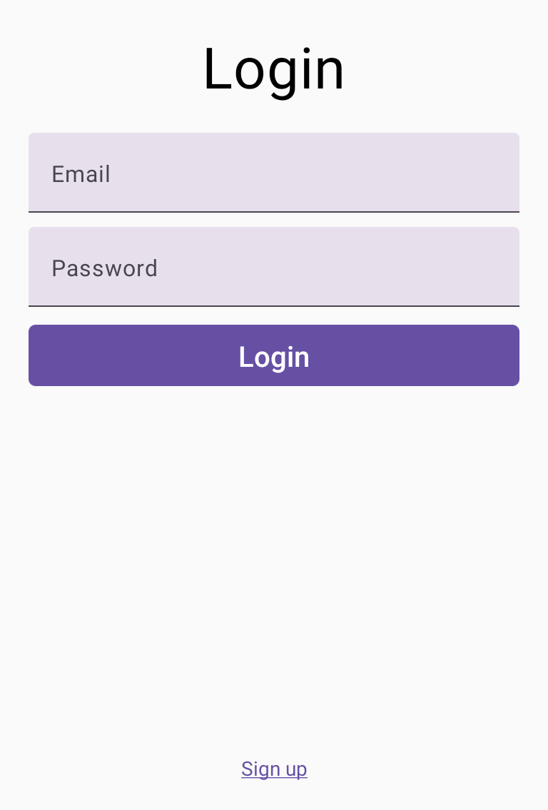
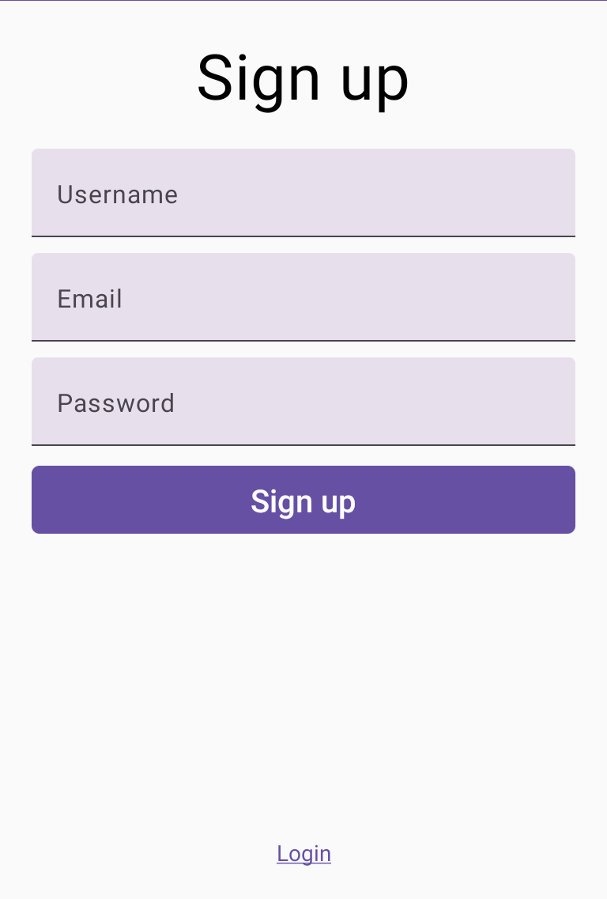
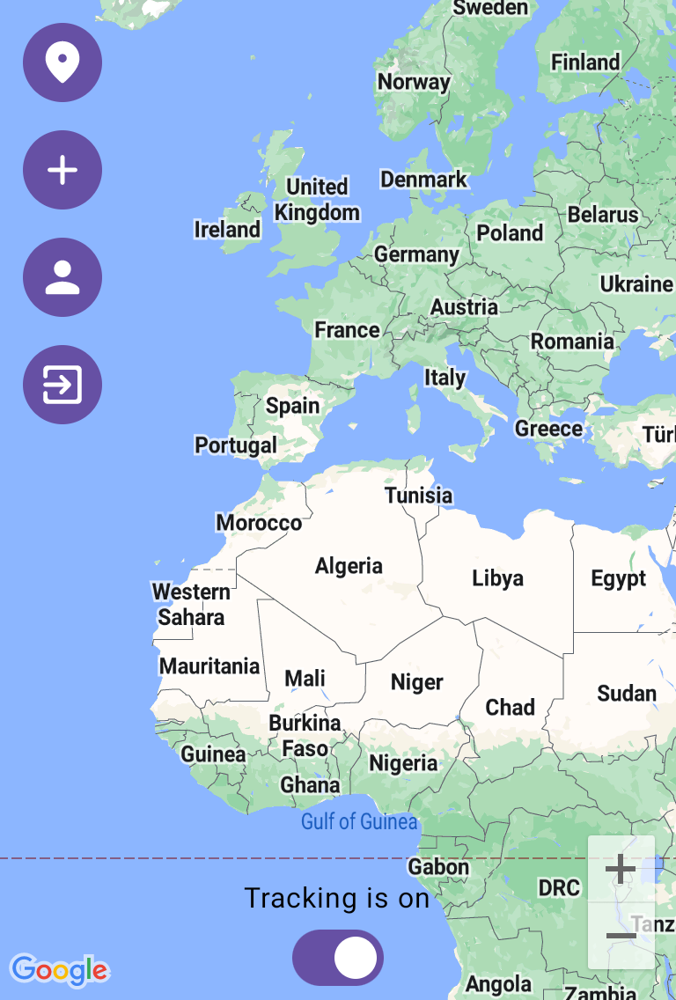
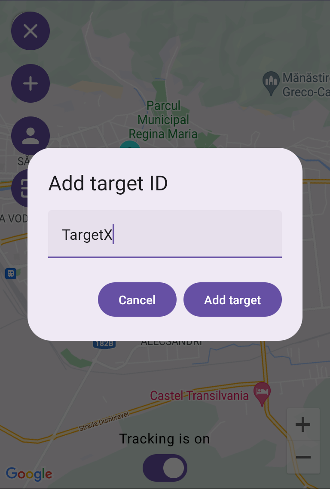
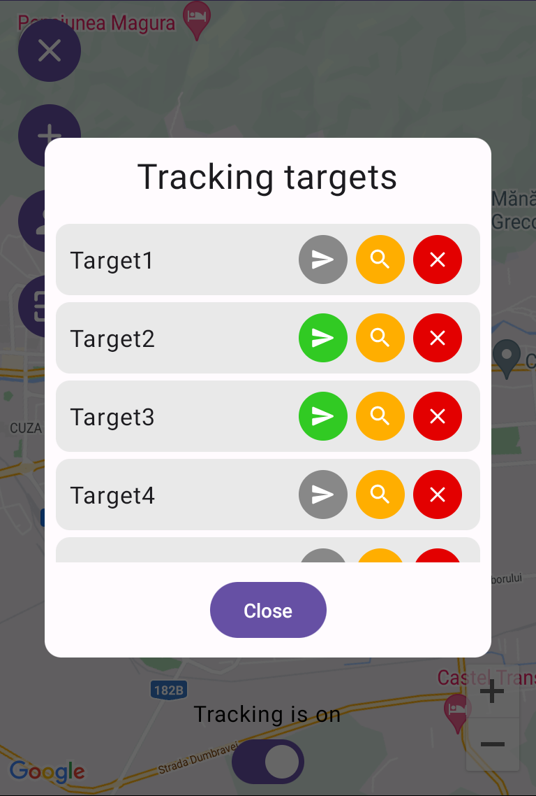
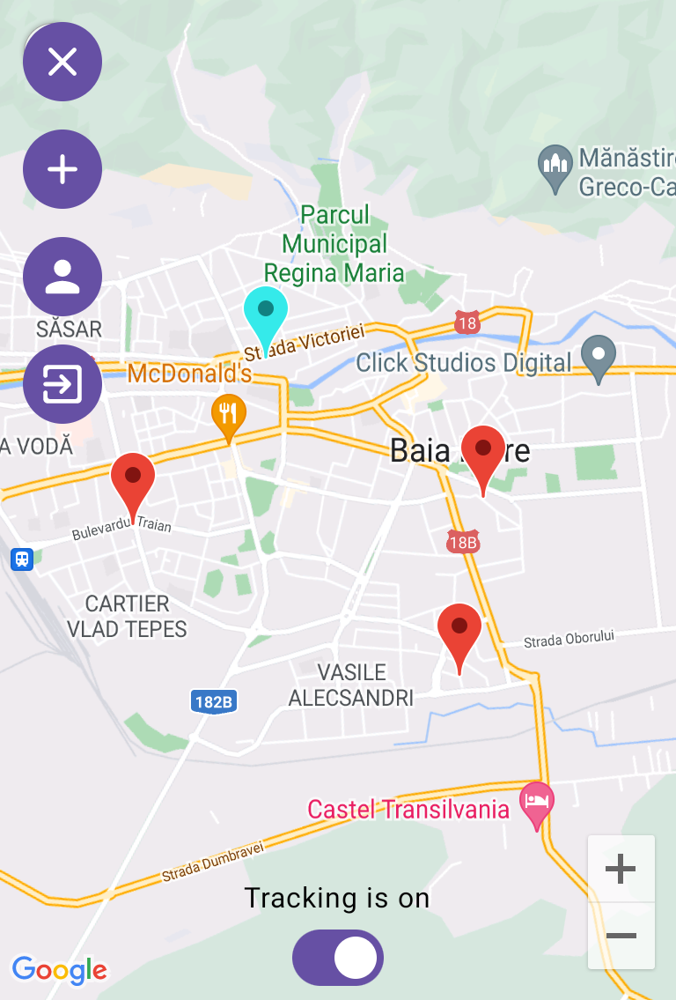
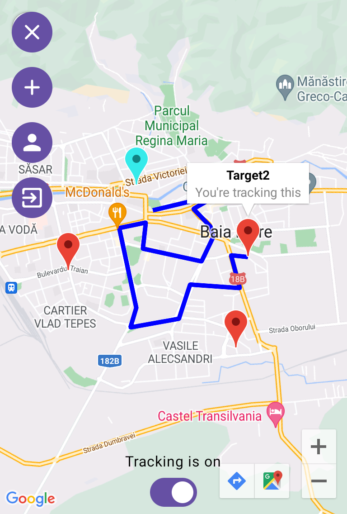

# 📡 TrackerLocationConsumer

Android application for monitoring small children and pets through the MQTT protocol.

The [TrackerLocationSender](https://github.com/MadalinDolca/TrackerLocationSender) app can be used to obtain and publish the current device location.
For more information about MQTT read this [documentation](https://github.com/MadalinDolca/TrackerLocationSender/blob/master/README.md).

🗓️ Developed during a summer intership at Cognizant

## ✨ Features
- Authentication system 
- Connects to the tracking MQTT Broker
- Subscribes to `tracker/location` topic to obtain location messages
- Displays the current user location on the map
- Allows adding targets (tracking subjects) by their associated ID
- Obtains and records the location of the targets
- Allows target management
- Stores target data in Firestore
- Displays the current location of all active targets on the map
- Displays the route taken by the selected target
- Displays a route that takes the current user to the selected target

⚠️ The location messages must have this format `{"clientId":"<INSERT_ID>","latitude":<INSERT_LAT>,"longitude":<INSERT_LON>}`

## 🔮 Technologies
- **Kotlin** for the app logic
- **Jetpack Compose** for the app UI
- **Compose Destinations** for navigation across the app
- **Kotlin Coroutines** to write non-blocking code that can be suspended and resumed
- **Kotlin Flows** to handle streams of data asynchronously
- **Koin** for dependency injection
- **Firebase** for authentication and database
- **Google Maps SDK** to show the map, routes, markers, and other related elements
- **Fused Location Provider** to obtain the current location of the device
- **MQTT Protocol** to subscribe to topics, publish location messages, and to receive them
- **HiveMQ** as an MQTT Broker

## 🏗️ Architecture
This application follows the **Model-View-Intent** (MVI) architecture.

## 👀 Preview

| Login | Sign up | Map |
| - | - | - |
|  |  |  |

| Add tracking subject | Manage tracking subjects | Display active tracking subjects |
| - | - | - |
|  |  |  |

| Route taken by the selected target |
| - |
|  |
